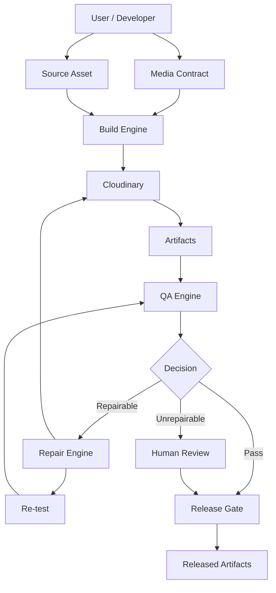
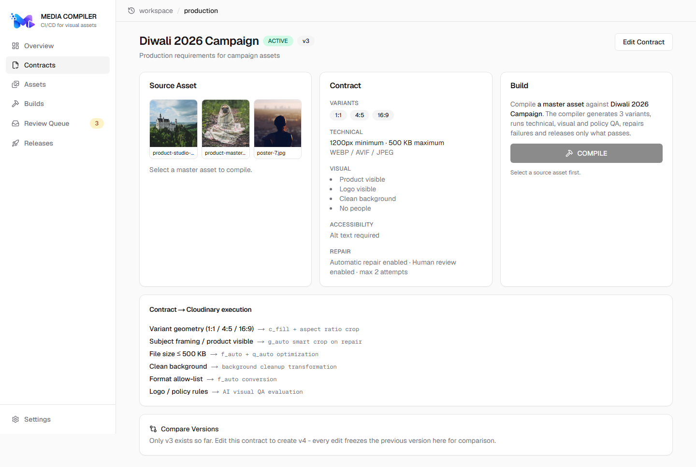
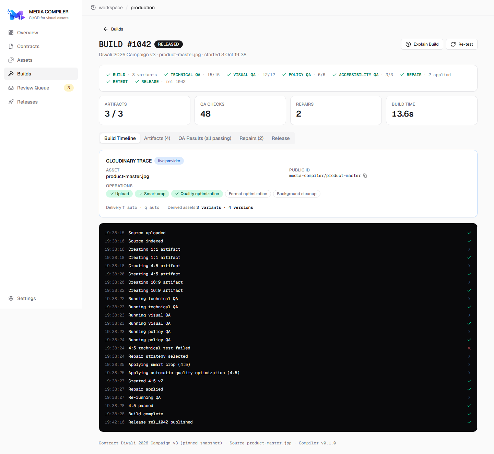
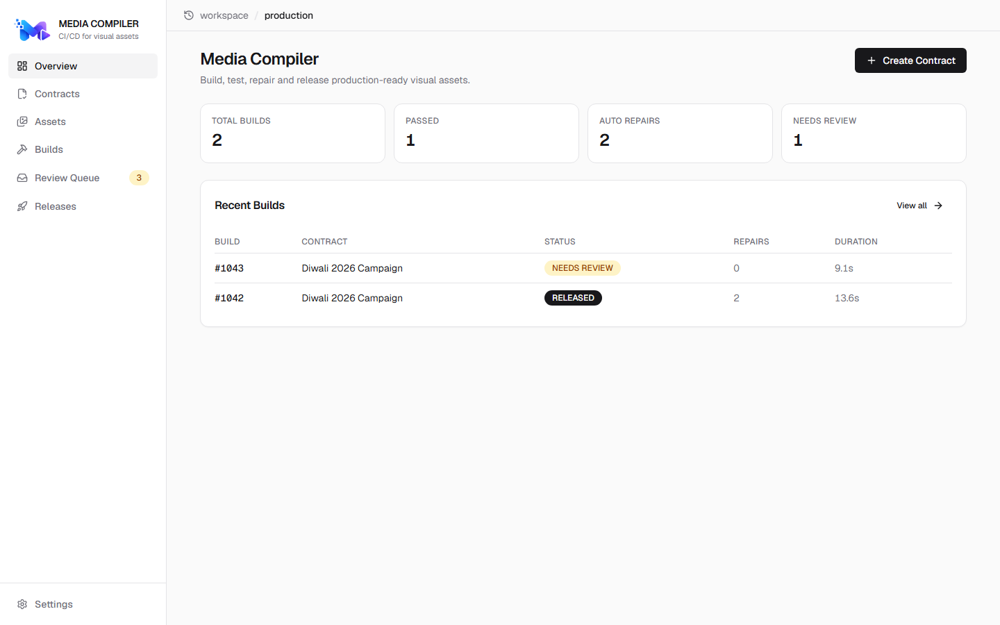
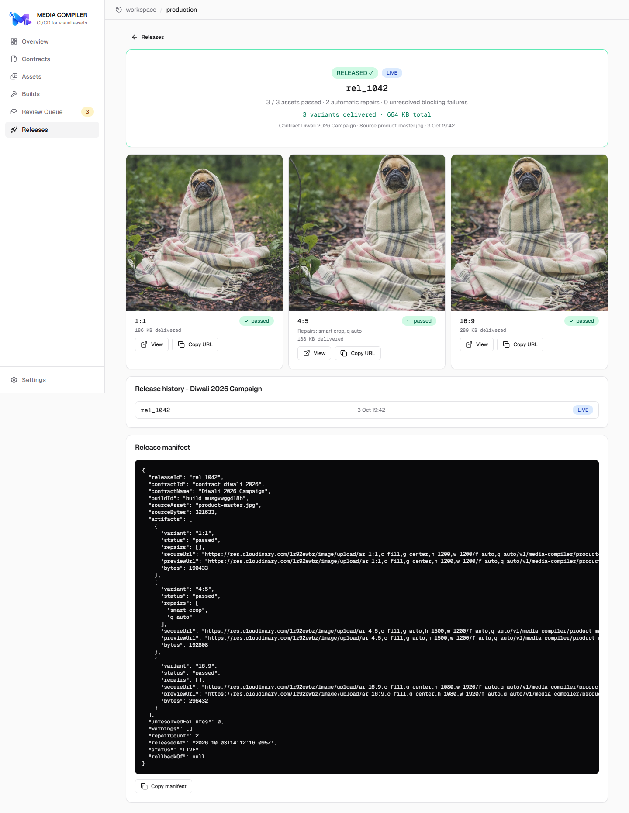
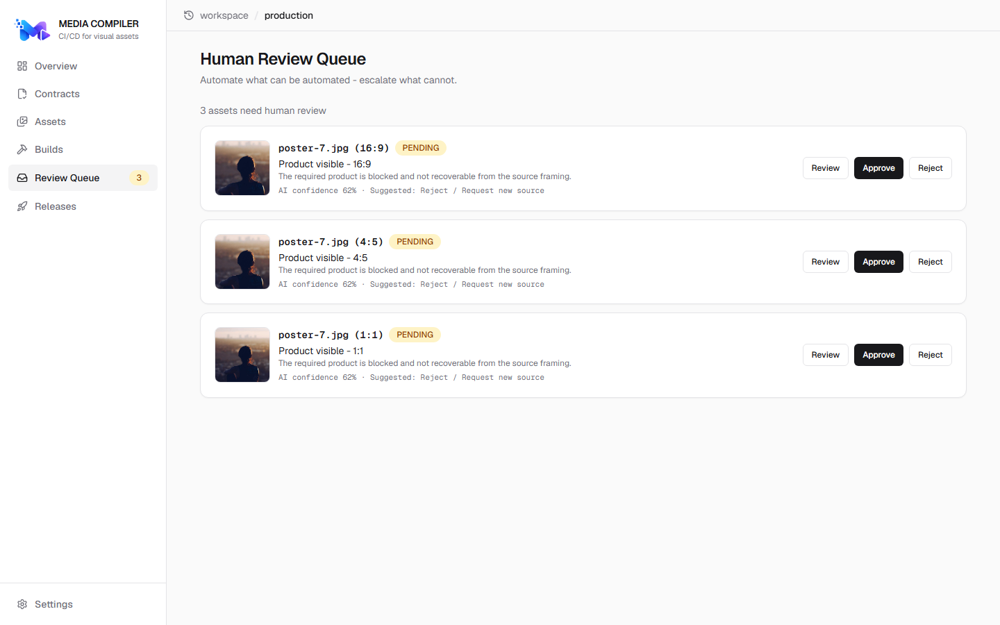

# Media Compiler

<p align="center">
  
</p>

<p align="center">
  <a href="https://hackindia.org/2026/pixels-to-products-cloudinary-ai-hackathon-2026"></a>
  
  
  
</p>

> **Topics:** `cloudinary` · `hackathon` · `nextjs` · `ci-cd` · `media-processing` · `quality-assurance` · `typescript` · `tailwindcss` · `devtools`

## CI/CD for Visual Assets

**Build. Test. Repair. Release.**

> Media Compiler treats visual media like software artifacts. Teams define executable Media Contracts, compile source assets into production variants, run technical and visual QA, repair safe failures, re-test the result, and release only verified artifacts.

<!-- Demo video (2–4 min): record the Demo Flow below and link it here. -->

```text
Media Contract → Build → Test → Repair → Re-test → Release
```

## Why Media Compiler?

Software has specifications, builds, automated tests, artifacts, CI, pull requests, release gates, and rollback. Visual media usually has source files, manual resizing, manual QA, repeated exports, ad-hoc publishing, and limited auditability.

The analogy this project implements:

```text
Software: Write → Build → Test → Fix → Re-test → Deploy
Media:    Specify → Build → Test → Repair → Re-test → Release
```

That mapping is the central conceptual innovation — not another editor, generator, or dashboard.

## The Problem

Common problems in media production (they grow with asset volume and channel count):

- One source asset must ship as many variants, each with different dimensions.
- File-size and format requirements differ by destination.
- Cropping can remove important subjects or text.
- Brand rules (logo, background, spacing) can break during transformation.
- AI-generated variants can drift from the original product.
- Promotional overlays or watermarks can violate channel requirements.
- Sensitive information can slip into user-provided assets.
- Optimizations can change visual quality in ways nobody checks.
- Manual QA becomes repetitive; failed transforms get fixed by hand.
- There is little auditability around what changed, when, and why.
- A source change can silently invalidate downstream artifacts.
- Teams lose track of which published assets depend on which source.

## The Solution

Media Compiler introduces a lifecycle for media:

- **Media Contract** — an executable specification of what "production-ready" means (variants, technical/visual/policy/accessibility rules, severity, repair budget).
- **Source Asset** — one master, ingested through Cloudinary.
- **Build** — variants generated as versioned artifacts (`4:5 v1`, `4:5 v2`, …).
- **QA** — deterministic technical checks, structured visual/policy evaluation, accessibility checks.
- **Repair** — safe Cloudinary transformations, bounded by attempts and severity.
- **Re-test** — the full suite runs again; repairs that break other rules are explicitly rejected.
- **Release** — server-side gate; only verified builds ship, with rollback.

## How It Works

1. Define a versioned **Media Contract** (or start from a preset: E-commerce, Google Shopping, Social).
2. Upload a master asset (Cloudinary Upload Widget → real `public_id`).
3. Click **Compile**. The build log streams: source → variants → QA → decision.
4. A failure shows **why** (rule, measured actual vs required, repairability).
5. **Auto Repair** applies a Cloudinary transformation, creates a new artifact version, re-tests.
6. Unrepairable cases go to **human review** with confidence and a suggested action.
7. **Release** publishes Cloudinary delivery URLs plus a stored manifest. Compare contract versions, check regressions, roll back when needed.

## Media Contract

> A Media Contract is an executable specification describing what a production-ready media artifact must satisfy — similar in spirit to API contracts, infrastructure policy, and CI configuration.

Illustrative shape (see `src/lib/contracts.ts` for the exact schema):

```yaml
# Illustrative — field names simplified
name: Ecommerce Product
variants: ["1:1", "4:5", "16:9"]
technical: { min_width: 1200, max_size_kb: 500 }
visual: { product_visible: true, logo_visible: true }
privacy: { faces: forbidden }
repair: { auto_repair: true, max_attempts: 2 }
```

Contracts are **versioned** (`v1`, `v2`, `v3`…): every edit freezes the previous snapshot, every build pins the version it compiled against, and **Compare Versions** shows ADDED/REMOVED/CHANGED rows with impact and one-click rebuild.

## End-to-End Example

Real numbers from a verified demo run (Diwali Campaign v3, limit 500 KB):

```text
Master: product-master.jpg (real Cloudinary asset)

1:1  ✓  (190 KB measured)
4:5  ✕  Product partially cropped · 1,305,828 B > 500 KB
16:9 ✓  (296 KB measured)

Repair: smart crop + q_auto → 4:5 v2 created

Re-test: 4:5 v2 ✓ (192,808 B measured, all checks green)

Release: 3/3 artifacts passed · 0 unresolved blocking failures
```

Second demo: `poster-7.jpg` → logo unrecoverable (62% confidence) → `AUTO-REPAIR NOT SAFE` → human review.

## Target Users

| Target user | Pain | Media Compiler value |
|---|---|---|
| E-commerce teams | Hundreds of product variants, channel rules | Automated variant builds + release gates |
| Creative operations | Repetitive campaign QA | Contract-driven validation |
| Marketing agencies | Many clients, channels, approval cycles | Reusable versioned contracts |
| Brand teams | Brand drift across variations | Logo/background policy QA + gates |
| Publishers / platforms | High-volume editorial or user media | Consistent processing + audit trail |
| Developers / platform teams | Media lacks CI/CD tooling | API, CLI, GitHub Action |

No customers are claimed — these are target users.

## Use Cases

1. **E-commerce product media** — one photo → 1:1/4:5/16:9 with visibility, crop-safety, logo, background, size-budget, format checks.
2. **Marketing campaign release** — validate dozens of assets against one contract before release.
3. **Website/app media delivery** — dimensions, format, size, optimization, and delivery-URL checks.
4. **Brand compliance** — logo presence, clean backgrounds, unauthorized-mark policy.
5. **Privacy-safe uploads** — faces/PII policy evaluation with repair-or-escalate behavior.
6. **AI-generated creative QA** — 🚧 Roadmap: identity/drift verification against requirements.
7. **Media localization** — 🚧 Roadmap: translated text, safe areas, locale variants.

## Key Capabilities

Contract versions + diff · build matrix (1:1/4:5/16:9) · measured technical QA · structured visual/policy/accessibility QA · severity (BLOCK/WARN/INFO) · confidence-aware review · bounded auto-repair with explicit rejection · full re-test · visual regression vs release baseline · artifact lineage (v1→v2) · server-side release gate (409) · release history + auditable rollback · Cloudinary Trace · human review queue · Explain Build · CLI + GitHub Action.

## Why Cloudinary?

**Cloudinary = media execution layer. Media Compiler = media lifecycle layer.**

Cloudinary provides upload, storage, transformations, analysis primitives, metadata, optimization, and delivery. Media Compiler adds contracts, build plans, artifact lifecycle, QA orchestration, repair strategy, re-test, regression policy, release gates, versioning, lineage, and audit trail — without reimplementing media infrastructure, and without implying Cloudinary lacks workflow capabilities.

## Cloudinary Integration

| Capability | How Media Compiler uses it | Status |
|---|---|---|
| Upload | Source ingestion via Upload Widget + signed API uploads | ✅ Implemented |
| Transformations | Variant builds, smart-crop + `q_auto`/`f_auto` repairs | ✅ Implemented |
| AI/media analysis | Structured evaluation framework; provider wiring | 🚧 Roadmap — not claimed as wired |
| Metadata | Contract/build/release context tagged on assets | ✅ Implemented |
| Optimized delivery | Released artifact URLs | ✅ Implemented |
| Search API | Asset/build discovery | 🚧 Roadmap |
| Webhooks | Async operation callbacks | 🚧 Roadmap |

## Architecture



Route handlers are thin; all logic lives in `src/lib/` (`contracts`, `qa`, `repair`, `regression`, `engine`, `cloudinary`, `transform-map`, `store`). The Cloudinary adapter is the only place that knows SDK details.

## Engineering Principles

- **Deterministic checks first** — dimensions, ratio, measured size/format, metadata need no AI.
- **AI for perception, not authority** — observations carry confidence; the contract/release engine decides.
- **Repair is followed by full re-test** — a repair that breaks another blocking rule is explicitly rejected.
- **No unsafe auto-publishing** — uncertain cases go to human review with confidence shown.
- **Server-side release gate** — the browser cannot declare an artifact passed (409 on violation).

## Reliability & Safety

> Media Compiler does not treat AI output as an unconditional release authority.

Concretely: severity-gated checks, confidence thresholds with review routing, bounded repair attempts (default 2, no infinite loops), persisted build events for every transition, immutable contract snapshots per build, superseded artifact versions retained for lineage, and retries surface errors instead of failing silently.

## Cost Considerations

Media Compiler is orchestration code — operating cost is dominated by media infrastructure usage (this is qualitative; see official sources for numbers):

- [Cloudinary billing and plans](https://cloudinary.com/documentation/billing_and_plans) — credit-based model across transformations, storage, bandwidth.
- [Cloudinary pricing](https://cloudinary.com/pricing) — plan tiers and current rates.

Illustrative MVP shape (not a quote): low asset volume, image-only, a handful of transformations per build, small storage/bandwidth. Production cost scales with transformations, storage, bandwidth, and any AI usage. Teams should estimate from expected build volume using the official billing docs.

## Cost Optimization

The compiler reduces processing waste by design:

- Validate cheap deterministic rules before expensive analysis.
- Reuse derived artifacts; rebuild only affected assets after a contract change.
- Repair instead of regenerate where safe; stop after configured attempts.
- Only run AI checks the contract requires; compile only what changed.
- Ship `f_auto`/`q_auto` optimized delivery.

No savings figures are claimed beyond per-asset measured bytes shown in the product.

## Business Model (potential — not operating)

- **Team subscription** — builds, assets, projects, seats.
- **Usage-based** — compiled assets, QA runs, media volume.
- **Enterprise** — SSO/RBAC, audit exports, policy governance, SLA, private infrastructure.

No revenue, customers, or pricing is claimed.

## Competitive Positioning

| Category | What it does |
|---|---|
| Generic image editor | Changes individual assets |
| Generic media management | Organizes assets |
| AI image generator | Creates assets |
| Cloudinary | Media infrastructure + transformation/management capabilities |
| **Media Compiler** | **Defines production requirements; manages artifact lifecycle through build, QA, repair, verification, release** |

No rankings, "best", or "only" claims — the distinction is the category, not superiority.

## Why Not a Script?

A script transforms files. Media Compiler manages specifications, build lifecycle, artifacts, test results, repair history, contract versions, regressions, human review, release gates, release history, and lineage.

## Why Not Just Cloudinary?

Cloudinary provides media capabilities; Media Compiler provides the lifecycle abstraction — repeatable builds with contracts, tests, repair policies, and release gates on top of those capabilities.

## Implementation Status

| Capability | Status |
|---|---|
| Media Contracts (versioned + history + diff) | ✅ Implemented |
| Build engine + state machine | ✅ Implemented |
| Technical QA (measured bytes/format/dims) | ✅ Implemented |
| Visual/policy/accessibility QA framework | ✅ Implemented (deterministic contract evaluation) |
| Cloudinary AI visual analysis | ⚠ Roadmap — framework ready, provider not wired; never claimed otherwise |
| Severity (BLOCK/WARN/INFO) + confidence review | ✅ Implemented |
| Auto-repair + budgets + explicit rejection | ✅ Implemented |
| Re-test (full suite) | ✅ Implemented |
| Visual regression vs baseline (blocking) | ✅ Implemented (metadata comparison) |
| Artifact lineage (v1 → v2) | ✅ Implemented |
| Release gate (server-side 409) | ✅ Implemented |
| Release history + rollback | ✅ Implemented |
| Cloudinary Trace | ✅ Implemented |
| Human review queue | ✅ Implemented |
| Explain Build (from persisted data) | ✅ Implemented |
| Contract presets | ✅ Implemented |
| GitHub Action + CLI | ✅ Implemented |
| Video / batch / webhooks / search / OCR & face detection | 🚧 Roadmap |

## Demo

**3-minute demo:** contract → upload master → Compile → live log → open the 4:5 failure → why → Auto Repair → re-test → Release → Cloudinary Trace → live artifact URL. Then `poster-7.jpg` for the review branch, and Compare Versions after any contract edit.

**30-second evaluation (for judges):**

1. Open any failed build → Release tab → RELEASE — the server refuses with `409 RELEASE BLOCKED`.
2. Open a build → Timeline → Cloudinary Trace — every operation maps to a real public ID and transformation.
3. Edit any contract → Compare Versions — diff, impact, one-click rebuild.

## Screenshots

| Contract | Build detail |
|---|---|
|  |  |

| Dashboard | Release | Review queue |
|---|---|---|
|  |  |  |

## Project Structure

```text
src/
├── app/                  # routes: dashboard, contracts, builds, assets, review, releases + api/
│   └── api/              # thin route handlers (contracts, assets, builds/*, reviews, releases)
├── components/
│   ├── ui/               # shadcn-style primitives (Radix): button, card, dialog, tabs…
│   ├── build/            # build log, artifacts, stages, trace, lineage, diff
│   └── layout/           # app shell (sidebar + header)
└── lib/
    ├── contracts.ts      # Zod schemas, presets, version diff
    ├── qa.ts             # technical / visual / policy / accessibility QA
    ├── repair.ts         # failure → strategy mapping
    ├── regression.ts     # baseline comparison
    ├── engine.ts         # compile pipeline, repair/retest, release gate, rollback
    ├── cloudinary.ts     # SDK adapter (only Cloudinary-aware module)
    ├── transform-map.ts  # client-safe contract → transformation mapping
    ├── store.ts          # file-backed JSON store + seed data
    └── api.ts            # TanStack Query client
scripts/                   # mc-check CLI, Cloudinary seed/upload helpers
.github/workflows/         # media-compiler.yml
docs/                      # spec notes, build record, Cloudinary verification artifacts
```

## Tech Stack

Next.js 16 · TypeScript (strict) · Tailwind CSS v4 · shadcn-style UI (Radix) · Lucide icons · TanStack Query · React Hook Form + Zod · Sonner · `cloudinary` + `next-cloudinary` · Vitest.

## Quick Start

```bash
git clone https://github.com/zlynv/Media-Compiler.git
cd Media-Compiler
npm install
cp .env.example .env.local
npm run dev
```

Open [http://localhost:3000](http://localhost:3000). Seeded contracts and demo assets load automatically.

## Deploying on Vercel

The repo builds cleanly (`npm run build` verified) with no special config — import it in Vercel and set the five environment variables above in the project dashboard (same values as `.env.local`).

Two serverless caveats to know (both by design for the MVP):

- **Builds run in-process.** Compiles execute as background steps on the server that accepted them. On serverless this works for click-through demos, but long builds can be cut off if the function is frozen — for a guaranteed live demo, run `npm run build && npm start` on any stateful host (Render, Railway, Fly, a VM).
- **Persistence is file-local.** The JSON store lives with the server instance, so data resets across serverless instances/restarts. Seeds reload automatically, so the demo always starts from the same state.

No `vercel.json` is needed; Node runtime is default (no edge-only APIs are used).

## Cloudinary Setup

1. Create a free account at [cloudinary.com](https://cloudinary.com) (official site).
2. From the [Cloudinary Console](https://console.cloudinary.com/) copy cloud name, API key, API secret into `.env.local` (see `.env.example`).
3. Create an **unsigned** upload preset ([Upload presets docs](https://cloudinary.com/documentation/upload_presets)) and set `NEXT_PUBLIC_CLOUDINARY_UPLOAD_PRESET`.
4. Restart the dev server, upload a source from any contract, and Compile.

## Environment Variables

| Variable | Client? | Purpose |
|---|---|---|
| `CLOUDINARY_CLOUD_NAME` | No | SDK config |
| `CLOUDINARY_API_KEY` | No | SDK config |
| `CLOUDINARY_API_SECRET` | **No — never** | SDK config, server-only |
| `NEXT_PUBLIC_CLOUDINARY_CLOUD_NAME` | Yes | Upload Widget |
| `NEXT_PUBLIC_CLOUDINARY_UPLOAD_PRESET` | Yes | Unsigned preset |

## Testing

```bash
npm test        # Vitest — 30 passing (verified)
npm run build   # production build (verified)
npm run lint    # eslint
```

## Security

- API secret is server-only and never bundled to the browser (verified absent from client chunks).
- Contracts validated with Zod server-side; release eligibility enforced server-side.
- Client-provided QA results or build statuses are never trusted.
- No credentials in the repository (`.env*` ignored; `.env.example` holds placeholders only).
- Historical builds keep immutable contract snapshots; rollback creates new records.

## Limitations

- Image-first MVP; video pipeline deferred.
- Visual AI provider wiring is roadmap — current visual checks are deterministic contract evaluation (labeled as such in-product).
- Advanced Cloudinary analysis capabilities depend on account provisioning.
- File-backed JSON store suits demo/MVP scale; production needs Postgres + durable queues.
- Provenance/ownership cannot be inferred from pixels; rights remain a metadata/approval concern.
- Uploaded media may be sensitive — configure Cloudinary privacy/retention to suit.

## Scaling Path

| Current (MVP) | Future production |
|---|---|
| File-backed JSON store | PostgreSQL + durable data store |
| In-process build steps | Queue + workers with webhooks |
| Image-first | Video/audio pipelines |
| Single app | API + worker + event architecture |

## Roadmap

- **Near term:** AI visual-analysis provider, richer rules, policy packs, stronger regression.
- **Developer platform:** deeper CI integrations, batch builds.
- **Enterprise:** RBAC/SSO, audit exports, policy governance.
- **Media expansion:** video, localization, accessibility depth, provenance.

## Business / Product Roadmap

- **Phase 1:** Media build/QA platform (this repo).
- **Phase 2:** Developer integrations (Action + CLI shipped; registries next).
- **Phase 3:** Enterprise media release platform.
- **Phase 4:** Media CI/CD infrastructure API.

## Security / Privacy Note

Do not commit credentials. The Cloudinary secret is server-only. AI-assisted checks are probabilistic — human review exists for uncertain cases. No compliance certifications are claimed.

## Hackathon

Built for **Pixels to Products — Cloudinary AI Hackathon 2026** ([official event page](https://hackindia.org/2026/pixels-to-products-cloudinary-ai-hackathon-2026)), track: **AI Media Pipelines**. No placement or ranking is claimed.

## License

To be added on public release.
